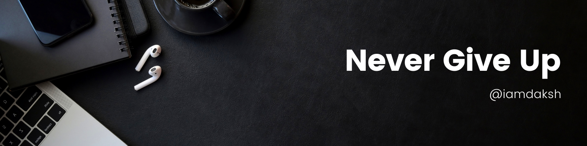

# Hi there 👋
## About Me
- Enthusiastic data science enthusiast currently pursuing a Master's in Applied Data Science at USC.
- Accumulated over 2 years of hands-on experience in data science, with a focus on deep learning methodologies.
- Proficient in implementing and fine-tuning deep learning models using frameworks like TensorFlow and PyTorch.
- Actively engaged in coursework and projects that encompass various aspects of data analysis, predictive modeling, and machine learning.
- Eager to leverage my academic journey and practical skills to address real-world challenges and drive data-driven solutions.
- Committed to staying abreast of emerging trends in data science and deep learning to remain at the forefront of the field.
- Seeking opportunities to collaborate, learn, and contribute to the vibrant data science community.

## **Skills**:
* Skills: Python (Advanced), Tensorflow, Numpy, Pandas, OpenCV (Basic), Scikit-Learn, Matplotlib, Seaborn, Flask/Django.
* Databases: PostgreSQL
* Tools: PyCharm, Postman, DataSpell, Docker, AWS, GitHub 
* Operating System: Linux, macOS, Windows

 ## **WHAT I DO**
- 🔭 I’m currently working as Research Assistant at Keck School of Medicine USC. 
- 🌱 I’m currently learning Deep Learning and DSA
- 👯 I’m looking to collaborate on projects based on Python
- 📫 How to reach me:  

## **My Github Stats**:

